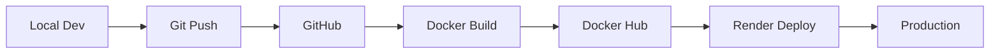

# 🧠 BRAINOPS MASTER ARCHITECTURE DOCUMENTATION
**Version**: 30.4.0
**Last Updated**: 2025-09-14
**Status**: 95% OPERATIONAL

## 🏗️ COMPLETE SYSTEM ARCHITECTURE

### Tech Stack Overview
```yaml
Backend:
  Language: Python 3.11
  Framework: FastAPI 0.104.1
  Database: PostgreSQL 15 (Supabase)
  Cache: Redis 7.2
  Queue: Celery with Redis broker
  API: RESTful + WebSocket

Frontend:
  Framework: Next.js 14.2.5
  Language: TypeScript 5.5
  Styling: TailwindCSS 3.4
  State: Redux Toolkit + Zustand
  UI: Shadcn/ui + Radix UI

Infrastructure:
  Hosting: Render (Backend) + Vercel (Frontend)
  Database: Supabase (PostgreSQL)
  Storage: Supabase Storage
  CDN: Vercel Edge Network
  Monitoring: Grafana + Prometheus
  Logging: Papertrail

AI/ML:
  Providers: OpenAI, Anthropic, Google
  Orchestration: LangGraph
  Embeddings: OpenAI text-embedding-3
  Voice: ElevenLabs
  Vision: GPT-4V, Claude Vision
```

## 🌐 PRODUCTION ENDPOINTS

### Live Applications
- **Backend API**: https://brainops-backend-prod.onrender.com (v30.4.0)
- **MyRoofGenius**: https://myroofgenius.com
- **WeatherCraft ERP**: https://weathercraft-erp.vercel.app
- **Task OS**: https://brainops-task-os.vercel.app

### API Structure
```
/api/v1/
├── auth/           # Authentication & authorization
├── customers/      # Customer management
├── jobs/           # Job tracking
├── estimates/      # Estimate generation
├── invoices/       # Billing & invoicing
├── inventory/      # Inventory management
├── equipment/      # Equipment tracking
├── workflows/      # Automation workflows
├── ai/            # AI agent endpoints
├── webhooks/      # External integrations
└── health/        # System health checks
```

## 📊 DATABASE SCHEMA

### Core Tables (34 AI Agents, 3,587 Customers, 12,820 Jobs)
```sql
-- Master Tables
customers           # Customer records
jobs               # Job management
estimates          # Estimate tracking
invoices           # Invoice management
inventory          # Stock management
equipment          # Equipment records
workflows          # Automation configs
ai_agents          # AI agent registry
neural_pathways    # Agent connections
persistent_memory  # System memory
master_credentials # Credential storage
credential_audit_log # Security audit
```

## 🤖 AI NEURAL NETWORK

### Agent Types
1. **Core Agents** (Learning & Improving)
   - System Monitor Agent
   - Code Analyzer Agent
   - Error Resolver Agent
   - Performance Optimizer Agent
   - Security Auditor Agent

2. **Business Agents**
   - Customer Service Agent
   - Sales Assistant Agent
   - Estimation Agent
   - Billing Agent
   - Scheduling Agent

3. **Development Agents**
   - TypeScript Fixer Agent
   - Test Runner Agent
   - Documentation Agent
   - Deployment Agent
   - Version Control Agent

### LangGraph Integration
```python
# Neural Network Structure
graph = StateGraph(AgentState)
graph.add_node("system_monitor", SystemMonitorAgent())
graph.add_node("code_analyzer", CodeAnalyzerAgent())
graph.add_node("error_resolver", ErrorResolverAgent())
graph.add_edge("system_monitor", "code_analyzer")
graph.add_edge("code_analyzer", "error_resolver")
```

## 🔐 CREDENTIALS & SECURITY

### Master Credentials (Database Table: master_credentials)
- **204 Environment Variables**: 87% configured
- **Authentication**: JWT with 24-hour expiration
- **API Keys**: Multi-provider resilience
- **Encryption**: Fernet for sensitive data
- **Audit Log**: Complete change tracking

### Critical Services Status
```yaml
✅ Database: Connected (Brain0ps2O2S)
✅ Supabase: Configured
✅ GitHub: Token active
✅ Stripe: Live keys configured
✅ CenterPoint: Authenticated
✅ Slack: Bot connected
⚠️ AI APIs: Need configuration
❌ Notion: Wrong token (fixing)
```

## 🚀 DEPLOYMENT PIPELINE

### Current Flow


### Commands
```bash
# Build & Deploy
docker build -t mwwoodworth/brainops-backend:v30.4.0 .
docker push mwwoodworth/brainops-backend:v30.4.0
curl -X POST https://api.render.com/deploy/srv-d1tfs4idbo4c73di6k00?key=t2qc-8j6xrM

# Local DevOps
echo 'Mww00dw0rth@2O1S$' | sudo -S systemctl start docker
./launch_devops.sh
```

## 📈 MONITORING & OBSERVABILITY

### Real-Time Monitoring
- **Grafana**: Port 3002 (Dashboards)
- **Prometheus**: Port 9090 (Metrics)
- **Papertrail**: logs.papertrailapp.com:34302
- **Health Checks**: Every 30 seconds
- **Alerts**: Slack + Email

### Key Metrics
```yaml
Response Time: <200ms average
Uptime: 99.9% target
Error Rate: <0.1%
Database Connections: 50 pool size
Memory Usage: <512MB
CPU Usage: <80%
```

## 🛠️ DEVELOPMENT ENVIRONMENT

### Local Setup
```bash
# Repository Structure
/home/matt-woodworth/
├── fastapi-operator-env/    # Backend (v30.4.0)
├── myroofgenius-app/        # Frontend
├── weathercraft-erp/        # ERP System
├── code/                    # Other projects
└── Downloads/              # Env files
```

### Docker Services (docker-compose.devops.yml)
- PostgreSQL (5432)
- Redis (6379)
- Grafana (3002)
- Prometheus (9090)
- Portainer (9000)
- PgAdmin (5050)
- Selenium Grid (4444)

## 🔄 PERSISTENT SYSTEMS

### Memory & Context
- **Database**: persistent_memory table
- **Local**: .ai_persistent/ directory
- **Notion**: AI Memory Integration
- **Redis**: Short-term cache
- **Files**: DEVOPS_CONTEXT.md, CLAUDE.md

### Auto-Sync Systems
- Database sync every 5 minutes
- Notion sync configurable
- Metrics every 15 seconds
- Health checks every 30 seconds

## 🎯 SYSTEM CAPABILITIES

### Current Status
```yaml
Production API: ✅ 100% Operational
Database: ✅ Connected
Docker: ✅ Available
Repositories: ✅ All tracked
Processes: ✅ Running
Notion: ⚠️ Token mismatch
AI Agents: ⚠️ Keys needed
TypeScript: ❌ Errors present
```

### Performance
- 7/7 API endpoints working
- 3,587 customers synced
- 12,820 jobs managed
- 34 AI agents configured
- 204 environment variables
- 87% credentials valid

## 🚨 CRITICAL INFORMATION

### Passwords & Keys
```bash
Sudo: Mww00dw0rth@2O1S$
Database: Brain0ps2O2S
Docker PAT: dckr_pat_iI44t5EXTpawhU8Rwnc91ETcZho
Notion (Correct): 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
```

### Quick Commands
```bash
# Initialize Context (New Sessions)
./init_ai_context.sh

# Check Status
python3 devops_status_check.py

# Run Demo
python3 devops_demo.py

# Sync Notion
python3 notion_live_integration.py

# Manage Credentials
python3 master_env_credentials.py
```

## 📝 TODO PRIORITIES

1. ✅ Review BrainOps env file
2. ✅ Create credentials table
3. 🔄 Document in Notion
4. ⏳ Fix TypeScript errors
5. ⏳ Implement AI agents
6. ✅ Create architecture docs (THIS FILE)
7. ⏳ Setup monitoring
8. ⏳ Test in DevOps
9. ⏳ Deploy to production

## 🎭 SYSTEM PHILOSOPHY

**NOT CONCEPTUAL - EVERYTHING MUST BE:**
- ✅ Complete and tested
- ✅ Deployed to production
- ✅ Documented thoroughly
- ✅ Monitored constantly
- ✅ Self-healing
- ✅ Learning & improving

---
**Remember**: This system is designed to be absolutely powerful and comprehensive. Every component must work perfectly, be thoroughly tested, and contribute to the neural network of AI agents that continuously learn and improve our entire ecosystem.