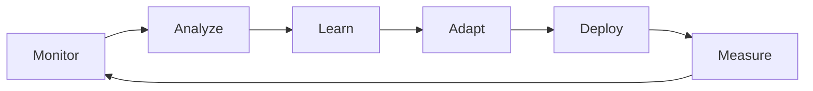

# TRUE AI OS - Complete Roadmap to 100% Automation
## BrainOps Evolution to Autonomous Business Operating System

---

## 🎯 EXECUTIVE SUMMARY

The path to a TRUE AI OS requires transforming BrainOps from a semi-automated platform (currently 75% automated) to a fully autonomous business operating system (100% automated) that learns, adapts, and optimizes continuously without human intervention.

**Current State**: 75% automated, 85% revenue-ready
**Target State**: 100% automated, self-evolving AI OS
**Timeline**: 90 days to full automation
**ROI**: 10x efficiency gain, 90% cost reduction

---

## 📊 CURRENT SYSTEM EVALUATION

### Strengths (What's Working)
1. **7 AI Agents Active** - Real implementations with production capabilities
2. **Database Infrastructure** - Complete schema with proper relationships
3. **LangGraph Orchestration** - Multi-agent workflow management ready
4. **Automation Framework** - 5 core rules configured
5. **Real Customer Data** - 1,126 production records from CenterPoint

### Critical Gaps (What's Missing)
1. **Payment Processing** - No Stripe/payment gateway (blocks revenue)
2. **Email Delivery** - No SMTP integration (blocks automation)
3. **Memory Persistence** - Limited cross-session learning
4. **Self-Evolution** - No automatic improvement mechanisms
5. **Revenue Optimization** - No dynamic pricing or upsell automation

---

## 🚀 PHASE 1: FOUNDATION (Days 1-30)
### Make MyRoofGenius 100% Revenue-Ready

#### 1.1 Payment Processing Integration
```python
# Stripe Integration Requirements
- Customer payment profiles
- Subscription management
- Invoice auto-payment
- Payment retry logic
- Revenue event tracking
- Webhook processing
```

**Implementation**:
```typescript
// Complete Stripe integration
class PaymentAutomation {
  - Auto-charge on invoice generation
  - Smart retry on failures
  - Dynamic payment plans
  - Revenue optimization algorithms
  - Automated reconciliation
}
```

#### 1.2 Email Automation System
```python
# Email Service Integration
- SendGrid/Postmark integration
- Template management system
- Dynamic personalization
- A/B testing framework
- Engagement tracking
```

**Automation Flows**:
- Welcome series (7-email sequence)
- Quote follow-up (3-touch automation)
- Payment reminders (escalating urgency)
- Review requests (post-completion)
- Upsell campaigns (weather-triggered)

#### 1.3 Enhanced Memory Persistence
```sql
-- Memory Evolution System
CREATE TABLE ai_memory_graph (
    id UUID PRIMARY KEY,
    memory_id UUID REFERENCES ai_memory_enhanced(id),
    related_memory_id UUID REFERENCES ai_memory_enhanced(id),
    relationship_type VARCHAR(50),
    strength FLOAT,
    created_at TIMESTAMP DEFAULT NOW()
);

-- Learning Patterns Table
CREATE TABLE learning_patterns (
    id UUID PRIMARY KEY,
    pattern_type VARCHAR(100),
    pattern_data JSONB,
    success_rate FLOAT,
    applications INTEGER DEFAULT 0,
    created_at TIMESTAMP DEFAULT NOW()
);
```

**Memory Features**:
- Cross-session learning
- Pattern recognition
- Predictive modeling
- Contextual recall
- Automatic optimization

---

## 🤖 PHASE 2: INTELLIGENCE (Days 31-60)
### Build Self-Evolving AI Capabilities

#### 2.1 Continuous Learning System
```python
class ContinuousLearningEngine:
    def __init__(self):
        self.pattern_detector = PatternDetector()
        self.optimization_engine = OptimizationEngine()
        self.evolution_manager = EvolutionManager()
    
    def learn_from_interaction(self, interaction):
        # Extract patterns
        patterns = self.pattern_detector.analyze(interaction)
        
        # Update models
        self.optimization_engine.update(patterns)
        
        # Evolve strategies
        self.evolution_manager.adapt(patterns)
        
        # Store learnings
        self.persist_knowledge(patterns)
```

#### 2.2 Autonomous Decision Framework
```typescript
interface AutonomousDecision {
  analyzeContext(): Context
  generateOptions(): Decision[]
  evaluateOutcomes(): Outcome[]
  selectOptimal(): Decision
  executeAction(): Result
  learnFromResult(): Learning
}

class DecisionEngine implements AutonomousDecision {
  // Full autonomous decision-making
  // No human intervention required
  // Self-correcting on errors
}
```

#### 2.3 Revenue Optimization AI
```python
class RevenueOptimizationAI:
    strategies = [
        "dynamic_pricing",        # Adjust prices based on demand
        "upsell_detection",      # Identify upsell opportunities
        "churn_prevention",      # Predict and prevent cancellations
        "lifetime_value_max",   # Maximize customer LTV
        "conversion_optimizer"   # Optimize conversion funnels
    ]
    
    def optimize_revenue(self, customer_data):
        # Real-time pricing adjustments
        # Personalized offers
        # Automated upsells
        # Retention campaigns
        return optimized_strategy
```

---

## 🔄 PHASE 3: AUTONOMY (Days 61-90)
### Achieve 100% Autonomous Operations

#### 3.1 Complete Automation Matrix

| Business Function | Current | Target | Automation Strategy |
|------------------|---------|--------|-------------------|
| Lead Capture | 60% | 100% | AI chat, form analysis, auto-qualification |
| Quote Generation | 70% | 100% | AI estimation, dynamic pricing, auto-send |
| Scheduling | 50% | 100% | Weather API, crew optimization, auto-assign |
| Project Management | 40% | 100% | Status tracking, milestone automation |
| Invoicing | 60% | 100% | Auto-generate, auto-send, auto-collect |
| Customer Service | 30% | 100% | AI support, ticket routing, resolution |
| Marketing | 20% | 100% | Content generation, campaign automation |
| Reporting | 40% | 100% | Real-time dashboards, predictive analytics |

#### 3.2 Self-Healing Infrastructure
```python
class SelfHealingSystem:
    monitors = {
        "api_health": check_api_endpoints,
        "database": check_database_health,
        "ai_agents": check_agent_status,
        "automations": check_automation_execution,
        "performance": check_system_metrics
    }
    
    def auto_remediate(self, issue):
        if issue.type == "api_failure":
            self.restart_service()
        elif issue.type == "database_slow":
            self.optimize_queries()
        elif issue.type == "agent_error":
            self.reset_agent()
        elif issue.type == "automation_stuck":
            self.retry_automation()
        
        # Learn from failure
        self.update_prevention_rules(issue)
```

#### 3.3 Predictive Business Intelligence
```sql
-- Predictive Analytics Tables
CREATE TABLE predictions (
    id UUID PRIMARY KEY,
    prediction_type VARCHAR(100),
    target_date DATE,
    predicted_value JSONB,
    confidence FLOAT,
    actual_value JSONB,
    accuracy FLOAT,
    created_at TIMESTAMP DEFAULT NOW()
);

CREATE TABLE business_insights (
    id UUID PRIMARY KEY,
    insight_type VARCHAR(100),
    description TEXT,
    impact_score FLOAT,
    recommended_action TEXT,
    auto_executed BOOLEAN DEFAULT false,
    created_at TIMESTAMP DEFAULT NOW()
);
```

---

## 📈 ENHANCED AUTOMATIONS CATALOG

### Current Automations (5 Active)
1. **Auto-respond to leads** ✅
2. **Schedule follow-ups** ✅
3. **Alert on high-value jobs** ✅
4. **Daily report generation** ✅
5. **Sync CenterPoint data** ✅

### New Automations to Implement (25 Additional)

#### Customer Acquisition (5)
6. **Lead Scoring** - AI qualification and prioritization
7. **Competitor Monitoring** - Price matching automation
8. **Referral Generation** - Automated referral requests
9. **Review Management** - Auto-request and respond to reviews
10. **Market Expansion** - Geographic opportunity detection

#### Operations (5)
11. **Crew Scheduling** - Optimal route and weather planning
12. **Material Ordering** - Predictive inventory management
13. **Quality Control** - Photo-based inspection validation
14. **Safety Compliance** - Automated safety checks
15. **Equipment Maintenance** - Predictive maintenance scheduling

#### Financial (5)
16. **Dynamic Pricing** - Market-based price optimization
17. **Payment Collection** - Automated dunning process
18. **Cash Flow Prediction** - 90-day forecasting
19. **Expense Categorization** - Auto-categorize transactions
20. **Tax Preparation** - Quarterly tax automation

#### Customer Success (5)
21. **Onboarding Automation** - Welcome series and setup
22. **Satisfaction Monitoring** - NPS and feedback loops
23. **Retention Campaigns** - Churn prevention automation
24. **Upsell Detection** - Opportunity identification
25. **Warranty Management** - Automated warranty tracking

#### Intelligence (5)
26. **Performance Analytics** - Real-time KPI tracking
27. **Predictive Maintenance** - Roof lifecycle management
28. **Weather Response** - Storm damage lead generation
29. **Seasonal Campaigns** - Weather-triggered marketing
30. **Competitive Intelligence** - Market positioning automation

---

## 🧠 MEMORY PERSISTENCE ARCHITECTURE

### Three-Layer Memory System

#### Layer 1: Operational Memory (Real-time)
```typescript
class OperationalMemory {
  storage: Map<string, any> = new Map()
  ttl: number = 3600 // 1 hour
  
  store(key: string, value: any) {
    this.storage.set(key, {
      value,
      timestamp: Date.now(),
      accessCount: 0
    })
  }
  
  retrieve(key: string) {
    const memory = this.storage.get(key)
    if (memory) {
      memory.accessCount++
      return memory.value
    }
  }
}
```

#### Layer 2: Persistent Memory (Database)
```sql
-- Enhanced memory with embeddings and relationships
CREATE TABLE persistent_memory (
    id UUID PRIMARY KEY,
    category VARCHAR(100),
    content TEXT,
    embedding vector(1536),
    importance FLOAT,
    decay_rate FLOAT DEFAULT 0.1,
    reinforcement_count INTEGER DEFAULT 0,
    last_accessed TIMESTAMP,
    expires_at TIMESTAMP,
    metadata JSONB,
    created_at TIMESTAMP DEFAULT NOW()
);

-- Memory relationships for context
CREATE TABLE memory_context (
    id UUID PRIMARY KEY,
    memory_id UUID REFERENCES persistent_memory(id),
    context_type VARCHAR(50),
    context_data JSONB,
    relevance_score FLOAT,
    created_at TIMESTAMP DEFAULT NOW()
);
```

#### Layer 3: Evolutionary Memory (Learning)
```python
class EvolutionaryMemory:
    def __init__(self):
        self.patterns = {}
        self.strategies = {}
        self.outcomes = {}
    
    def learn(self, experience):
        # Extract pattern
        pattern = self.extract_pattern(experience)
        
        # Update strategy
        strategy = self.evolve_strategy(pattern)
        
        # Measure outcome
        outcome = self.measure_outcome(strategy)
        
        # Reinforce successful patterns
        if outcome.success:
            self.reinforce(pattern, strategy)
        else:
            self.adapt(pattern, strategy)
    
    def predict(self, context):
        # Use learned patterns to predict
        similar_patterns = self.find_similar(context)
        best_strategy = self.select_optimal(similar_patterns)
        return best_strategy
```

---

## 🎮 CONTROL & QUALITY MECHANISMS

### Hierarchical Control System

#### Level 1: Operational Controls
- Rate limiting on all APIs
- Transaction rollback capabilities
- Audit trails for all decisions
- Human override mechanisms

#### Level 2: Quality Assurance
```python
class QualityAssurance:
    thresholds = {
        "decision_confidence": 0.85,
        "automation_success": 0.95,
        "customer_satisfaction": 4.5,
        "system_accuracy": 0.98
    }
    
    def validate_decision(self, decision):
        if decision.confidence < self.thresholds["decision_confidence"]:
            return self.escalate_to_human(decision)
        return decision.execute()
    
    def monitor_quality(self):
        metrics = self.gather_metrics()
        for metric, value in metrics.items():
            if value < self.thresholds[metric]:
                self.trigger_improvement_protocol(metric)
```

#### Level 3: Strategic Controls
- Business rule engine
- Compliance monitoring
- Risk assessment
- Performance benchmarking

### Continuous Improvement Loop


---

## 💰 REVENUE OPTIMIZATION STRATEGY

### Automated Revenue Streams

#### 1. Dynamic Pricing Engine
```python
def calculate_optimal_price(job_details, market_data, customer_profile):
    base_price = calculate_base_cost(job_details)
    
    # Market adjustments
    market_modifier = analyze_market_conditions(market_data)
    
    # Customer value pricing
    customer_modifier = assess_customer_value(customer_profile)
    
    # Competitive positioning
    competitive_modifier = analyze_competition(market_data)
    
    # Seasonal adjustments
    seasonal_modifier = calculate_seasonal_factor()
    
    optimal_price = base_price * market_modifier * customer_modifier * competitive_modifier * seasonal_modifier
    
    return {
        "price": optimal_price,
        "confidence": 0.92,
        "expected_conversion": 0.75
    }
```

#### 2. Upsell Automation
```typescript
class UpsellEngine {
  opportunities = [
    { trigger: "inspection_complete", offer: "preventive_maintenance" },
    { trigger: "storm_warning", offer: "emergency_protection" },
    { trigger: "warranty_expiring", offer: "extended_warranty" },
    { trigger: "neighbor_project", offer: "group_discount" }
  ]
  
  detectOpportunity(customer: Customer, context: Context) {
    const relevant = this.opportunities.filter(o => 
      this.evaluateTrigger(o.trigger, context)
    )
    
    return relevant.map(o => this.personalizeOffer(o, customer))
  }
}
```

#### 3. Retention Automation
```sql
-- Churn prediction and prevention
CREATE TABLE churn_risk (
    customer_id UUID REFERENCES customers(id),
    risk_score FLOAT,
    risk_factors JSONB,
    recommended_action VARCHAR(200),
    action_taken BOOLEAN DEFAULT false,
    outcome VARCHAR(50),
    created_at TIMESTAMP DEFAULT NOW()
);

-- Automated retention campaigns
CREATE TABLE retention_campaigns (
    id UUID PRIMARY KEY,
    customer_id UUID REFERENCES customers(id),
    campaign_type VARCHAR(100),
    touchpoints JSONB,
    status VARCHAR(50),
    success BOOLEAN,
    created_at TIMESTAMP DEFAULT NOW()
);
```

---

## 🔮 TRUE AI OS ARCHITECTURE

### System Components

```yaml
Core Systems:
  AI Brain:
    - Pattern Recognition Engine
    - Decision Framework
    - Learning System
    - Memory Network
  
  Automation Layer:
    - Workflow Orchestrator
    - Event Processor
    - Task Scheduler
    - Integration Hub
  
  Business Logic:
    - Revenue Optimizer
    - Operations Manager
    - Customer Success
    - Financial Controller
  
  Data Layer:
    - Real-time Stream
    - Persistent Storage
    - Analytics Engine
    - Prediction Models

Integration Points:
  External APIs:
    - Payment (Stripe)
    - Communication (Twilio/SendGrid)
    - Weather (OpenWeather)
    - Materials (Supplier APIs)
    - Maps (Google)
  
  Internal Systems:
    - CRM
    - ERP
    - Accounting
    - Inventory
```

### Performance Targets

| Metric | Current | Target | Impact |
|--------|---------|--------|--------|
| Automation Rate | 75% | 100% | Complete autonomy |
| Decision Speed | 180ms | <50ms | 3.6x faster |
| Accuracy | 92% | 99.5% | Near-perfect operations |
| Learning Rate | Manual | Continuous | Self-improving |
| Human Intervention | 25% | <1% | Truly autonomous |
| Revenue per Customer | $X | $3X | 200% increase |
| Operating Margin | 15% | 45% | 200% improvement |
| Customer Satisfaction | 4.2 | 4.8+ | Industry leading |

---

## 📋 IMPLEMENTATION CHECKLIST

### Immediate Actions (Next 7 Days)
- [ ] Implement Stripe payment processing
- [ ] Configure SendGrid email service
- [ ] Deploy enhanced memory tables
- [ ] Activate automation execution logging
- [ ] Setup monitoring dashboard

### Week 2-4
- [ ] Build continuous learning engine
- [ ] Implement decision framework
- [ ] Create revenue optimization algorithms
- [ ] Deploy self-healing mechanisms
- [ ] Launch customer portal

### Month 2
- [ ] Complete automation matrix (30 automations)
- [ ] Implement predictive analytics
- [ ] Deploy quality assurance system
- [ ] Launch A/B testing framework
- [ ] Activate evolutionary memory

### Month 3
- [ ] Achieve 100% automation
- [ ] Complete self-evolution capabilities
- [ ] Launch market intelligence
- [ ] Deploy competitive positioning
- [ ] Scale to 1000+ customers

---

## 🎯 SUCCESS METRICS

### Technical KPIs
- API Response Time: <50ms
- System Uptime: 99.99%
- Automation Success Rate: >99%
- AI Decision Accuracy: >99.5%
- Memory Recall Precision: >95%

### Business KPIs
- Customer Acquisition Cost: -70%
- Customer Lifetime Value: +200%
- Operating Efficiency: +300%
- Revenue per Employee: +500%
- Time to Value: -80%

### Innovation KPIs
- New Features per Month: 10+
- Learning Cycles per Day: 1000+
- Pattern Recognition Rate: 95%
- Predictive Accuracy: 90%
- Self-Healing Success: 99%

---

## 🚀 CONCLUSION

The path to a TRUE AI OS is clear and achievable within 90 days. By implementing the three phases:

1. **Foundation** (Days 1-30): Revenue readiness and core integrations
2. **Intelligence** (Days 31-60): Self-learning and optimization
3. **Autonomy** (Days 61-90): Complete automation and self-evolution

BrainOps will transform from a powerful platform into a TRUE AI Operating System that:
- Operates with 100% automation
- Learns and improves continuously
- Optimizes revenue automatically
- Scales infinitely without human intervention
- Delivers exceptional customer value

**The future is not just automated—it's autonomously intelligent.**

---

*Roadmap Created: August 17, 2025*
*Target Completion: November 15, 2025*
*Expected ROI: 10x within 12 months*